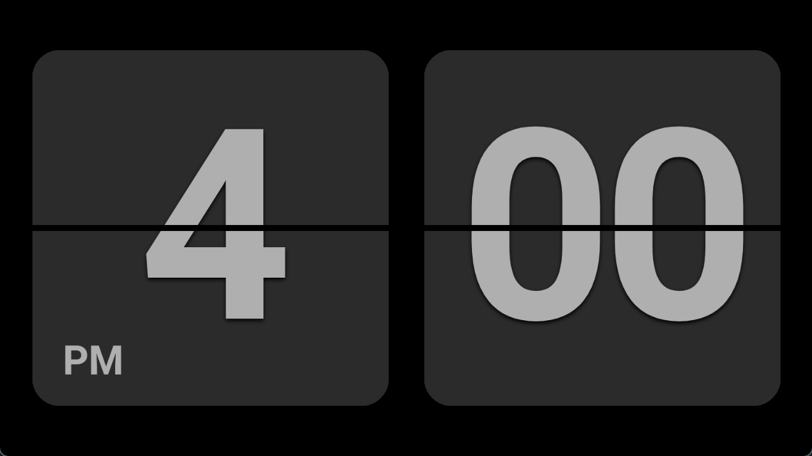
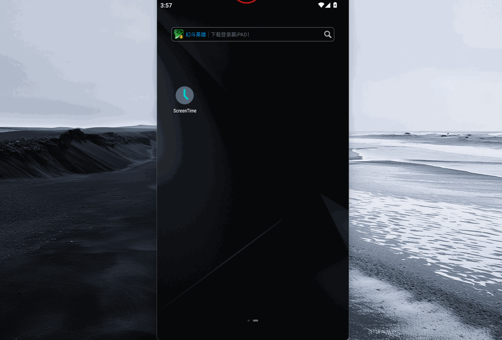

## 效果预览

## 相关参考

[lhw_0714/flip-clock-时间动画组件](https://gitee.com/lhw0714/flip-clock)

[【flipclock】类 Fliqlo 的 翻页时钟+日期 网页版](https://blog.csdn.net/Krone_/article/details/106392698)

---

[uni-app 设置当前page界面进入直接变为横屏模式](https://blog.csdn.net/weixin_45966674/article/details/134901609)

[uni-app中使用自定义字体](https://blog.csdn.net/qq_34378032/article/details/122431362)

[uniapp 如何去掉头部默认导航](https://blog.csdn.net/weixin_43337481/article/details/130018168)

[uniapp中隐藏Android虚拟按键](https://blog.csdn.net/sslcsq/article/details/127758065)

[UNI-APP设置屏幕保持常亮](https://blog.csdn.net/xialong_927/article/details/122927811)

